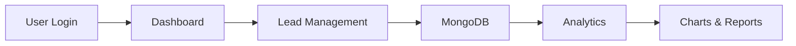

# Startup CRM Lite

A lightweight Customer Relationship Management (CRM) platform built with React, Node.js, Express, and MongoDB.

---

# Project Overview

Startup CRM Lite is a modern web-based CRM application designed to help startups and small businesses manage customer leads, track sales activity, and visualize business performance.

The application provides a responsive dashboard, lead management system, analytics, authentication pages, and cloud deployment support.

---

# Features

* Lead management

  * Add leads
  * Edit leads
  * Delete leads
  * View lead details

* Dashboard

  * KPI cards
  * Business overview
  * Quick statistics

* Analytics

  * Charts and reports
  * Lead insights
  * Visual data representation

* User interface

  * Responsive layout
  * Sidebar navigation
  * Navbar
  * Profile page

* Utilities

  * Excel export
  * Notifications
  * Search and filtering

* Deployment

  * Frontend deployed on Vercel
  * Backend deployed on Railway
  * MongoDB Atlas database

---

# Technology Stack

| Layer         | Technology                |
| ------------- | ------------------------- |
| Frontend      | React 19                  |
| Build Tool    | Vite                      |
| Backend       | Node.js                   |
| Server        | Express.js                |
| Database      | MongoDB Atlas             |
| ODM           | Mongoose                  |
| Charts        | Recharts                  |
| HTTP Client   | Axios                     |
| Routing       | React Router              |
| Icons         | Lucide React, React Icons |
| Notifications | React Hot Toast           |
| Export        | XLSX, File Saver          |
| Deployment    | Vercel, Railway           |

---

# Project Structure

```text
startup-crm-lite/

├── backend/
│   ├── config/
│   │   └── db.js
│   ├── controllers/
│   │   └── leadController.js
│   ├── middleware/
│   ├── models/
│   │   └── Lead.js
│   ├── routes/
│   │   └── leadRoutes.js
│   ├── server.js
│   └── package.json
│
├── public/
│
├── src/
│   ├── api/
│   │   └── leadApi.js
│   ├── components/
│   │   ├── analytics/
│   │   ├── common/
│   │   ├── dashboard/
│   │   └── leads/
│   ├── pages/
│   │   ├── Login.jsx
│   │   ├── Register.jsx
│   │   └── Profile.jsx
│   ├── App.jsx
│   ├── App.css
│   ├── index.css
│   └── main.jsx
│
├── package.json
└── vite.config.js
```

---

# Frontend Architecture

The frontend is built using React and Vite.

Main modules:

* Dashboard
* Analytics
* Lead Management
* Authentication Pages
* Profile Management
* Shared Components

Reusable UI components:

* Navbar
* Sidebar
* Lead Cards
* Lead Details
* Analytics Widgets

---

# Backend Architecture

The backend follows a simple MVC pattern.

### Model

* `Lead.js`

### Controller

* `leadController.js`

### Routes

* `leadRoutes.js`

### Database Configuration

* `db.js`

---

# Database

MongoDB Atlas is used for cloud storage.

Current collections:

* Leads

Future collections:

* Users
* Roles
* Notifications
* Activity Logs

---

# API Endpoints

## Lead APIs

### Get all leads

```http
GET /api/leads
```

### Add lead

```http
POST /api/leads
```

### Update lead

```http
PUT /api/leads/:id
```

### Delete lead

```http
DELETE /api/leads/:id
```

---

# Environment Variables

Create a `.env` file inside the backend folder.

```env
MONGO_URI=your_mongodb_connection_string

JWT_SECRET=your_secret_key

PORT=5000
```

---

# Installation

## Clone repository

```bash
git clone https://github.com/Anand2006-crypto/startup-crm-lite.git
```

---

## Frontend setup

```bash
npm install
npm run dev
```

---

## Backend setup

```bash
cd backend

npm install

npm run dev
```

---

# Run Locally

Frontend:

```bash
npm run dev
```

Open:

```text
http://localhost:5173
```

Backend:

```text
http://localhost:5000
```

---

# Deployment

## Frontend

Platform:

* Vercel

Steps:

1. Push code to GitHub.
2. Connect repository to Vercel.
3. Configure environment variables.
4. Deploy.

---

## Backend

Platform:

* Railway

Steps:

1. Connect GitHub repository.
2. Add environment variables.
3. Deploy service.

---

# Application Workflow



---

# Security Notes

Current implementation:

* MongoDB Atlas IP restrictions
* Environment variables
* Backend API separation

Planned improvements:

* JWT authentication
* User authorization
* Role-based access
* Per-user lead isolation

---

# Known Limitations

* Authentication system is not fully integrated.
* Leads are not yet isolated per user.
* Role management is not implemented.
* No automated testing pipeline.

---

# Future Roadmap

* JWT authentication
* User roles
* Team management
* Activity tracking
* Notifications
* Dark/light themes
* Email integration
* Search optimization

---

# Troubleshooting

## MongoDB connection error

Verify:

* `MONGO_URI`
* Atlas IP whitelist
* Database user credentials

---

## CORS issues

Check:

* Backend CORS configuration
* Railway domain
* Vercel domain

---

## Deployment failed

Verify:

* Environment variables
* Railway logs
* Build settings

---

# Credits

Developed by:

**Anand**

Technologies:

* React
* Vite
* Express
* MongoDB
* Railway
* Vercel

---

# License

This project is for educational and portfolio purposes.

---

# Final Summary

Startup CRM Lite is a full-stack CRM platform that enables startups and small teams to manage customer leads, monitor business growth, and visualize performance using a modern dashboard architecture.

It combines React, Express, MongoDB, and cloud deployment platforms into a lightweight, scalable CRM solution.
